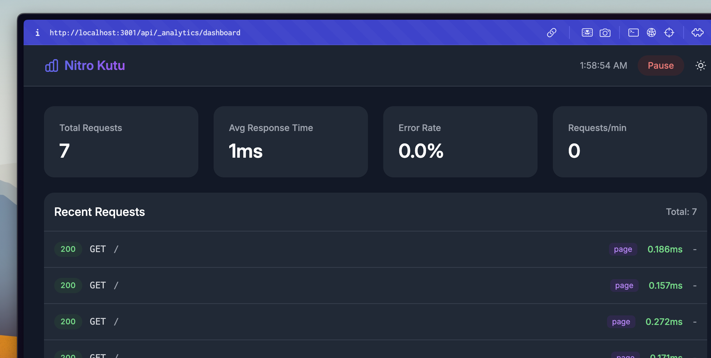

# Nitro Kutu




```ts
  ➜ Local:    http://localhost:3001/
  ➜ Network:  use --host to expose

[nitro 1:41:02 AM] ✔ Nitro Server built in 272 ms
01:41:02 □ ● GET │ / │ 2.386ms -
01:57:53 □ ● GET │ / │ 0.784ms -
01:57:53 □ ● GET │ / │ 0.603ms -
01:57:54 □ ● GET │ / │ 0.171ms -
01:57:54 □ ● GET │ / │ 0.272ms -
01:57:54 □ ● GET │ / │ 0.157ms -
01:57:55 □ ● GET │ / │ 0.186ms -
``` 

> [!NOTE]
> See requests in the terminal. Get more detail with the panel.

## Usage

First, install `nitro-kutu` packages as a dev dependency: ([unjs/nypm](https://nypm.unjs.io) will automatically detect your package manager!)

```sh
npx nypm@latest add -D nitro-kutu
```

For **Nuxt** update `nuxt.config.ts`:

```ts
export default defineNuxtConfig({
  modules: ["nitro-kutu"],
});
```

For **Nitro** update `nitro.config.ts`:

```ts
import nitroKutu from "nitro-kutu";

export default defineNitroConfig({
  modules: [nitroKutu],
});
```

## Dashboard

`http://localhost:3001/api/_analytics/dashboard` for the dashboard. `api/_analytics/dashboard` is the default path.


## Development

- Clone this repository
- Install the latest LTS version of [Node.js](https://nodejs.org/en/)
- Enable [Corepack](https://github.com/nodejs/corepack) using `corepack enable`
- Install dependencies using `pnpm install`
- Build in stub mode using `pnpm build --stub`
- Run Nitro playground using `pnpm dev:nitro` or Nuxt playground using `pnpm dev:nuxt`

## License

[MIT](./LICENSE)